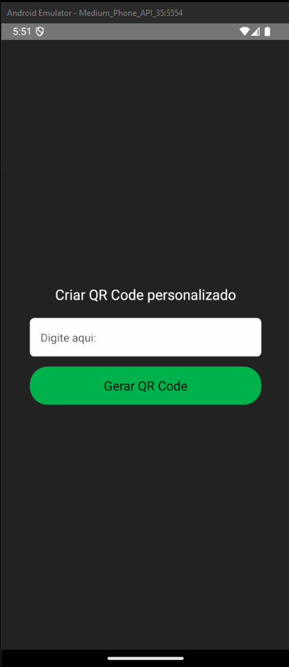
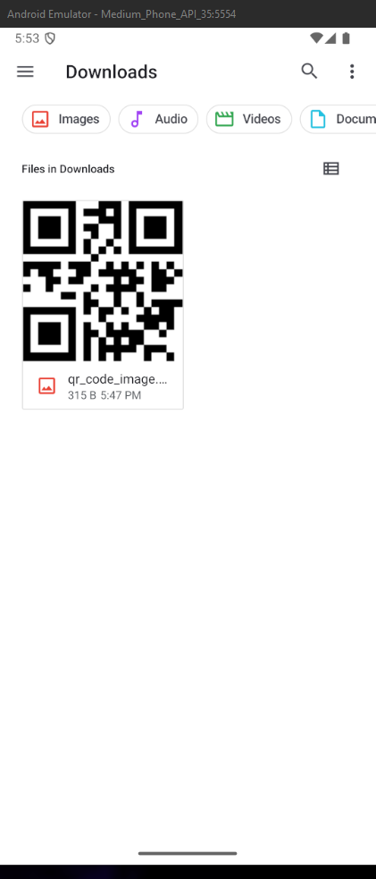

# App QR Code

## Conceito
Esse é um aplicativo mobile para gerar códigos **QR Code**. O usuário digita um texto e clica no botão, em seguida a imagem é gerada na tela e fica disponível uma opção para download.

## Tecnologia utilizada
Nesse sistema utilizei React Native pela praticidade no desenvolvimento. E também utilizei a API do https://goqr.me/api/ para geração dos códigos QR Code.

## Bibliotecas necessárias
    npm install --save styled-components
    npm install @react-navigation/native
    npm install @react-navigation/native @react-navigation/native-stack
    npm install react-native-screens react-native-safe-area-context
    npm install react-native-fs

## Como rodar o App
    npm run android

## Telas
### Tela inicial
  

### Tela após o Qr Code ser gerado
  

### Print da pasta download após o Qr Code ser baixado
  